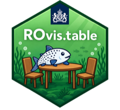

<!-- badges: start -->
[](https://github.com/rivm-syso/ROvis.table/actions/workflows/ci.yaml)
[](https://github.com/rivm-syso/ROvis.table/actions/workflows/ci.yaml)
[](https://github.com/rivm-syso/ROvis.table/actions/workflows/ci.yaml)
<!-- badges: end -->

# ROvis.table <a href="https://github.com/rivm-syso/ROvis.table"></a>

## Rijksoverheid Visualisatie - table

## Description
A tool to uniformly present tables using standardized Rijksoverheid (Dutch National Government) styling. This package is part of the [ROvis umbrella package] (https://github.com/rivm-syso/ROvis).

## Installation

```r
# Install from GitHub (private repo - requires GitHub auth, e.g. a PAT
# via usethis::create_github_token() / gitcreds, since this repo is private)
# install.packages("remotes")
remotes::install_github("rivm-syso/ROvis.table")
```

## Usage

```r
library(ROvis.table)

# Apply the Rijksoverheid-styled gt theme to a data frame
ro_gt_theme(head(mtcars, 5))
```

## Support
First point of contact for questions: ROvis team (spin@rivm.nl)

## Contributing
We welcome contributions and are always happy to see people help improve this package.
If you would like to contribute, please first open an issue to describe the bug, feature, or proposed change. Once you are ready, submit a pull request linked to that issue.
All contributions will be reviewed by the SPIN team before they are merged.

## Instructions for developers 

For information about R package development, check the [R Packages book](https://r-pkgs.org/). 
Below we describe the most important guidelines and practicalities.


### Requirements
We use the `testthat`, `lintr` and `roxygen2` package for development of tests, code style 
checks and automatic documentation. We also use the `devtools` and `usethis` package during 
development to adhere to standards for R packages and make developing easier! Install them 
in your Rstudio environment:

```r
install.packages("testthat")
install.packages("lintr")
install.packages("roxygen2")
install.packages("quarto")
install.packages("pkgdown")
install.packages("devtools")
install.packages("usethis")
```

### Guidelines
Type `devtools::load_all()` in your console each time you start developing. This loads 
all dependencies and non-exported functions in the NAMESPACE. This makes developing a lot easier!

To ensure code standardization and quality, follow these guidelines:
- Add tests with `usethis::use_test()`
- Add a new package dependency to the DESCRIPTION file with `usethis::use_package()`. We use 
the `min_version` argument to specify a minimum version. 
- Add a new function dependency to the NAMESPACE with `usethis::use_import_from()`
- Add documentation to new functions by inserting a roxygen skeleton and use `devtools::document()` to
create automatic documentation in the `man` folder

## Authors and acknowledgment
This R packages was created by ROvis team (spin@rivm.nl).

## License
This package uses an Apache license.
